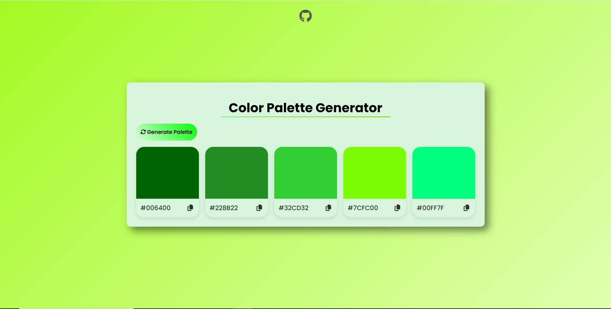
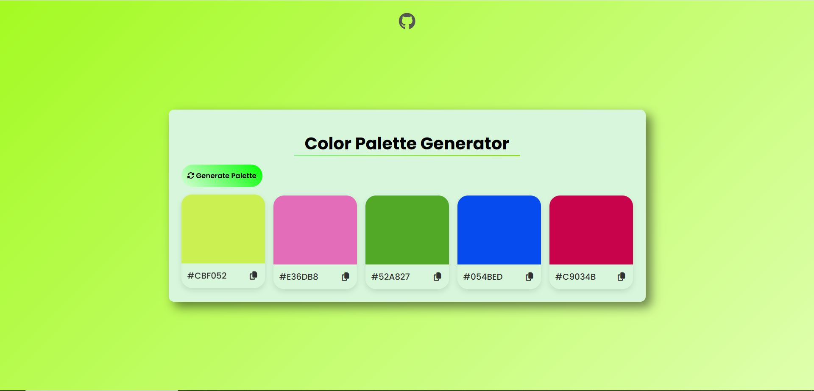

# 🎨 Color Palette Generator

Color Palette Generator adalah aplikasi web sederhana yang menghasilkan kombinasi warna acak dalam format hex code. Kamu juga bisa menyalin warna dengan sekali klik!

## 📸 Tampilan

  <!-- opsional, jika kamu punya screenshot -->

## 🚀 Fitur

- 🎲 Generate 5 warna hex acak
- 📋 Salin kode warna dengan klik ikon copy
- ✅ Feedback visual saat warna berhasil disalin
- 🌿 Warna default hijau saat pertama kali dibuka

## 🛠 Teknologi

- HTML5
- CSS3 (dengan gradient dan efek interaktif)
- JavaScript DOM API
- Font Awesome (untuk ikon)

## 📦 Cara Menjalankan

1. Buka link ini di browser:
   https://color-palette-generator-murex.vercel.app/